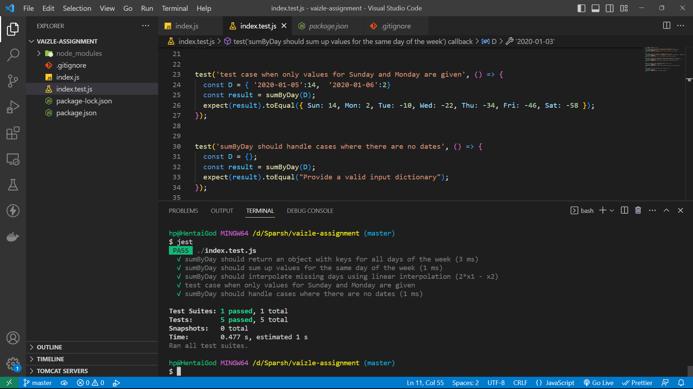

# Assignment for Web Development role.

### Problem. Given a dictionary D with key of the form "YYYY-MM-DD" and its corresponding value which is an integer, return a new dictionary 'ans' such that:
1. It's key (type: String) is a day: [Mon, Tue, Wed, Thu, Fri, Sat, Sun].
2. Corresponding value (type: Int) is the sum of all values on that particular day.
3. Also, if dictionary D doesn't have a particular day, then 'ans' dictionary will have the value of that day as the mean of previous and the next day.
4. Assume Mon and Sun always exists in D.

### NOTE: Write Unit tests as well.

### Finding value of missing days:
```
Suppose given days are: { Mon: 2, Tue: 4, Wed: 6, Thu: Undefined, Fri: Undefined, Sat: 12, Sun: 14 }
i.e Values of Thursday and Friday are missing
Now, to find value of 'Thursday'
Step 1: Consider value of 'Thursday' = y, value of 'Wednesday' (Previous day) = x1, and Value of 'Tuesday' (Previous of Previous day) = x2.
i.e { Tue: x2, Wed: x1, Thu: y }
Step 2: Value of x1 = mean of Previous and Next day, i.e x1 = (x2 + y)/2
Step 3: Value of y = (2*x1 - x2)

This is how I calculate the values of all the missing days.
Since Sunday and Monday are always given, that's why this method is guaranteed to always give an answer.
```

## How to Run:
### 1. clone the repository in you system:
```
git clone https://github.com/sparshkr24/Sparsh-Submission.git
```

### 2. Install dependencies from package.json
```
npm install
```

### 3. Install Jest framework for unit testing:
```
npm i jest-cli -g
```

### 4. Run Jest Testing
```
jest
```

## Unit Testing



## It's that Simple

## Thank You for considering my application. Looking forward to hearing from you soon.
